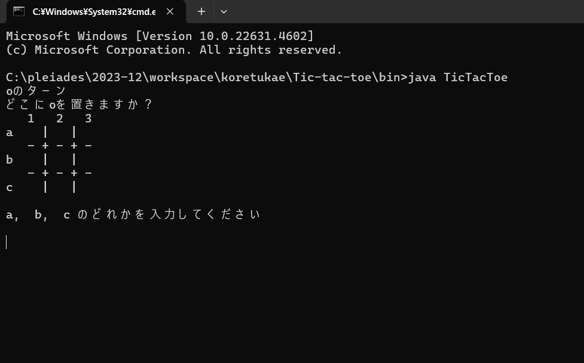
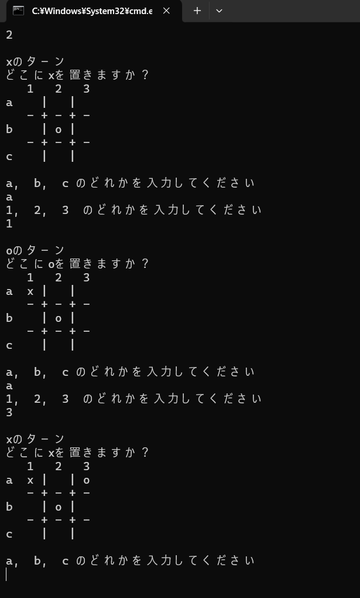
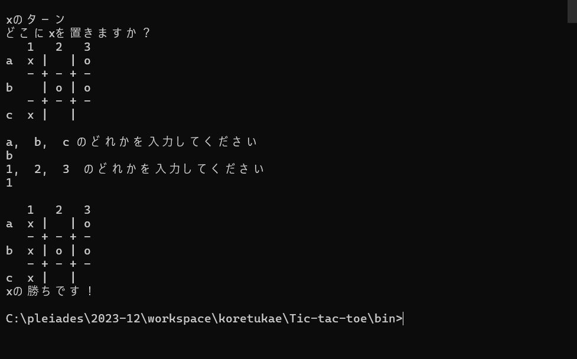
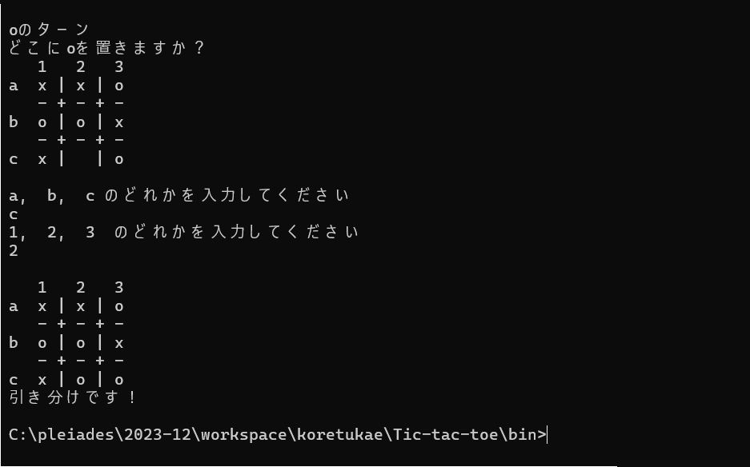

# tic-tac-toe

Javaで作ったコンソール出力を使って行う〇×ゲーム（三目並べ）です。  
初めにa,b,cのどれかを入力後エンターを押す、その後1,2,3のどれかを入力後エンターで〇や×を置く場所を指定します。

## 使い方

1. Javaがインストールされていることを確認してください。  
2. プロジェクトをクローンまたはダウンロードしてください。  
3. IDE（EclipseやIntelliJなど）で開いて実行してください。

## スクリーンショット

